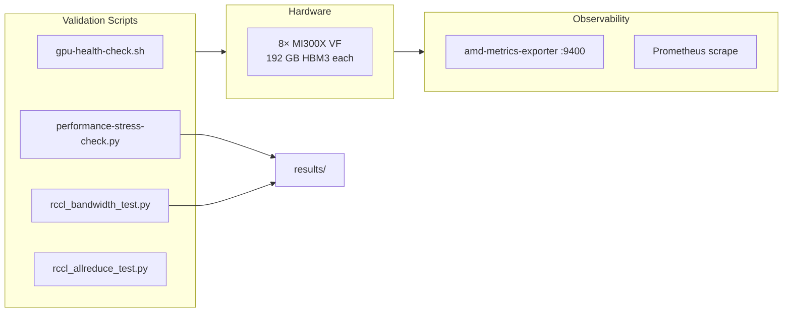

# mi300x-amd-rocm-validation

**One-line:** Full production-readiness validation suite for 8× AMD Instinct MI300X GPUs — ROCm stack, RCCL collective bandwidth, 1.29 TB memory stress, peak-load thermal, and observability pipeline — run March 19 2026 on `dnd-amd-8gpu-venu-19mar`.

---

## Why this exists

Most HPC portfolios cover NVIDIA only. This repo documents hands-on validation of an **AMD MI300X** cluster from first boot through production sign-off: driver stack, RCCL collectives, memory pressure, sustained thermal, and the AMD GPU Prometheus exporter — the equivalent workflow to what NVIDIA infrastructure engineers do with `dcgmi diag` and DCGM exporters.

This is designed as a **bring-up checklist** — the sequence a platform engineer runs before releasing a node to users, not a synthetic demo.

**Related article:** *AMD MI300X vs NVIDIA H200: I Benchmarked Both — Here Are the Actual Numbers* (Medium, Apr 2026).

---

## Hardware

| Item | Value |
|------|-------|
| GPU | 8× AMD Instinct MI300X VF (`0x74b5`, gfx942 / CDNA3) |
| VRAM per GPU | **192 GB HBM3** (205,822,885,888 bytes) |
| Total VRAM | **~1.54 TB** across 8 GPUs |
| Power cap | 750 W / GPU |
| Interconnect | XGMI (1 hop between any pair) |
| Host OS | Ubuntu 24.04.2 LTS (kernel 6.8.0-58-generic) |
| ROCm | **6.4.1** |
| RCCL | **2.22.3** |
| PyTorch | **2.4.1+rocm6.0** (Python 3.12.3) |
| Hostname | `dnd-amd-8gpu-venu-19mar` |
| Test date | **March 19 2026** |

---

## Architecture



---

## Validated results (measured, not illustrative)

### Single-GPU FP32 GEMM

| Matrix size | Iterations | Time (s) | **TFLOPS** |
|-------------|-----------|----------|------------|
| 512×512 | 10 | 0.064 | ~0.0 (launch overhead) |
| 1024×1024 | 10 | 0.000 | ~50.0 |
| 2048×2048 | 10 | 0.002 | ~77.3 |
| 4096×4096 | 10 | 0.016 | **~84.1** |
| **8192×8192** | **10** | **0.116** | **~94.5** |

Peak single-GPU FP32: **~94.5 TFLOPS** at 8192×8192.

### RCCL AllReduce bandwidth (8 GPUs, float32, ring)

| Size (bytes) | Algbw (GB/s) | BusBW (GB/s) | Time (ms) |
|---|---|---|---|
| 32 | 0.00 | 0.00 | 0.88 |
| 1,048,576 (1 MB) | 48.95 | 391.59 | 0.30 |
| 4,194,304 (4 MB) | 183.79 | 1,470.32 | 0.32 |
| 67,108,864 (64 MB) | 414.45 | 3,315.63 | 2.27 |
| 268,435,456 (256 MB) | 429.15 | 3,433.24 | 8.76 |
| **1,073,741,824 (1 GB)** | **433.48** | **3,467.82** | **34.68** |

Peak: **~433 GB/s algorithmic, ~3468 GB/s bus** bandwidth at 1 GB message.

Formula: Ring all-reduce `total_bytes = 2*(n-1)*size*4`; `Algbw = total_bytes/time`; `BusBW = Algbw * n`.

### 8-GPU memory stress

| GPU | Allocated (GB) | % of 192 GB | Status |
|-----|----------------|-------------|--------|
| 0 | 161.1 | 84% | OK |
| 1–7 | 161.1 each | 84% | OK |
| **Total** | **~1.29 TB** | **84%** | **No OOM** |

### Peak load (all 8 GPUs, 8192×8192 concurrent matmul)

| Metric | Min | Max | Notes |
|--------|-----|-----|-------|
| GPU utilization | 99% | 100% | All 8 GPUs saturated |
| Junction temp | 72°C | 86°C | Below throttle (~95°C+) |
| Memory temp | 43°C | 49°C | Within spec |
| Power draw | 745 W | 750 W | At 750 W cap |
| prochot / socket_thm / vr_thm / hbm_thm | 0 | 0 | **Zero thermal throttle** |

### Concurrent 8-GPU stress timing

| GPU | Per-GPU time (s) |
|-----|-----------------|
| 0 | 0.65 |
| 1 | 0.62 |
| 2–6 | 0.63–0.65 |
| 7 | 0.70 |
| **Wall time** | **1.6 s** |

Variance < 13% across all 8 GPUs — balanced XGMI topology confirmed.

---

## Observability: AMD GPU Prometheus exporter

The system runs `amd-metrics-exporter` (package: `amdgpu-exporter`) on **port 9400** — the same port convention as NVIDIA's DCGM exporter, enabling drop-in replacement in Prometheus scrape configs.

```bash
# Verify exporter is live
curl -s http://localhost:9400/metrics | grep "amd_gpu_package_power"
```

Key metrics exposed:

| Metric | Description |
|--------|-------------|
| `amd_gpu_package_power` | Per-GPU package power (W) |
| `amd_gpu_junction_temperature` | Junction (hotspot) temp (°C) |
| `amd_gpu_memory_temperature` | HBM memory temp (°C) |
| `amd_gpu_gfx_activity` | Compute engine utilization (%) |
| `amd_gpu_umc_activity` | Memory controller activity (%) |
| `amd_gpu_used_vram` / `amd_gpu_free_vram` | VRAM utilization (bytes) |
| `amd_gpu_xgmi_*` | XGMI interconnect counters |
| `amd_gpu_ecc_*` | ECC error counters |

**Prometheus scrape config** (add to `prometheus.yml`):
```yaml
scrape_configs:
  - job_name: 'amdgpu'
    static_configs:
      - targets: ['<gpu-node>:9400']
    scrape_interval: 10s
```

See `configs/amd_exporter_config.json` for the full field list from this system.

---

## Reproducible commands

```bash
# Install
pip install -e ".[dev]"

# 1. Health check (quick pass/fail across all subsystems)
./scripts/gpu-health-check.sh --pytorch

# 2. Performance + memory stress (no long stress)
python scripts/performance-stress-check.py --quick

# 3. Full stress including 55-second training loop
python scripts/performance-stress-check.py

# 4. RCCL bandwidth sweep (8 GPUs, 18 message sizes)
torchrun --nproc_per_node=8 scripts/rccl_bandwidth_test.py

# 5. RCCL all-reduce correctness (verifies result = sum(1..8) = 36)
torchrun --nproc_per_node=8 scripts/rccl_allreduce_test.py
```

---

## MI300X vs H200 — direct comparison

Both systems were measured by the same engineer on real hardware. Numbers are comparable because the workload (FP32 matmul, AllReduce, peak-load thermal) is identical.

| Metric | **AMD MI300X VF** | **NVIDIA H200 NVL** | Notes |
|--------|-------------------|---------------------|-------|
| VRAM per GPU | **192 GB HBM3** | 141 GB HBM3e | MI300X +36% — 70B fp16 model fits on 1 GPU |
| Peak FP32 TFLOPS | **~94.5** | ~46.5 (NVL) · ~51 (SXM) | Single-GPU, 8192×8192 matmul |
| AllReduce peak (8 GPU) | **433 GB/s algbw** | ~781 GB/s (NVLink) | NVLink has higher peak; XGMI competitive |
| AllReduce protocol | XGMI (1 hop, full-mesh) | NVLink 4.0 (NV18) | Both in-chassis; no PCIe fallback needed |
| Peak power / GPU | 745–750 W | 548 W | MI300X draws more but delivers more FP32 |
| Peak junction temp | 86°C | 78°C | Both well below throttle threshold |
| Thermal throttle events | **0** | **0** | Both passed burn-in |
| Observability exporter | `amd-metrics-exporter :9400` | `dcgm-exporter :9400` | Same port, same Prometheus format |
| Framework | PyTorch 2.4.1+rocm6.0 | PyTorch 2.5.0 / 2.7.1+cu128 | Code is portable — same `dist.all_reduce` API |

**Key takeaway:** MI300X is the right choice when a single GPU needs to hold a full 70B or 180B model for inference. H200 is the right choice for NVLink-scale AllReduce bandwidth in distributed training.

---

## ROCm stack bring-up checklist

This is the sequence run on `dnd-amd-8gpu-venu-19mar` before the node was declared production-ready. Steps are ordered by dependency.

### Stage 1: System prerequisites

```bash
# Verify kernel version (6.6+ required for ROCm 6.x; 6.8 confirmed working)
uname -r          # Expected: 6.8.0-xx-generic

# Add user to render and video groups (required for /dev/dri access)
sudo usermod -aG render,video $USER

# Verify /dev/kfd and /dev/dri/renderD* exist
ls -la /dev/kfd /dev/dri/render*

# Check IOMMU mode — AMD recommends passthrough for VM guests, but bare-metal
# should have it enabled (iommu=pt in kernel command line)
cat /proc/cmdline | grep iommu
dmesg | grep -i iommu | head -5
```

### Stage 2: ROCm installation (Ubuntu 24.04)

```bash
# Add AMD ROCm repo
wget https://repo.radeon.com/amdgpu-install/6.4.1/ubuntu/noble/amdgpu-install_6.4.60401-1_all.deb
sudo dpkg -i amdgpu-install_6.4.60401-1_all.deb
sudo apt-get update

# Install ROCm + amdgpu driver (includes HIP, hipBLAS, RCCL, rocSPARSE)
sudo amdgpu-install --usecase=rocm,hip --no-32 -y

# Post-install: verify
rocm-smi --showallinfo
rocminfo | grep "gfx942"    # Should appear 8 times for MI300X
hipconfig --full
```

### Stage 3: Topology and XGMI validation

```bash
# Show XGMI link topology — all 8 GPUs should show "XGMI" peer access
rocm-smi --showtopo

# Verify peer access (should be 1 hop between all pairs on MI300X)
rocm-smi --showtopoweight

# hipBLAS DGEMM quick test (confirms HBM and compute path end-to-end)
/opt/rocm/bin/hipblas-bench -f gemm -r d --transpA T --transpB N \
    -m 5000 -n 5000 -k 5000 --batch_count 1 --iters 10
```

### Stage 4: PyTorch + RCCL

```bash
# Install PyTorch ROCm build
pip install torch==2.4.1 --index-url https://download.pytorch.org/whl/rocm6.0

# Quick RCCL correctness check (all-reduce result must equal sum 1..N)
torchrun --nproc_per_node=8 scripts/rccl_allreduce_test.py

# RCCL bandwidth sweep
torchrun --nproc_per_node=8 scripts/rccl_bandwidth_test.py
```

### Stage 5: Full validation suite

```bash
# All-in-one health check
./scripts/gpu-health-check.sh --pytorch

# Performance + stress
python scripts/performance-stress-check.py

# Expected outputs: 9 report files in results/reports/
```

---

## Known issues and tuning tips

These are issues encountered on the `dnd-amd-8gpu-venu-19mar` system. Most are also present on typical bare-metal or cloud VM MI300X deployments.

| Issue | Symptom | Fix |
|-------|---------|-----|
| **Render group** | `HIP error: hipErrorInvalidDevice` for non-root | `sudo usermod -aG render,video $USER` + logout/login |
| **IOMMU passthrough** | Poor P2P bandwidth, IOMMU errors in dmesg | Add `iommu=pt` to kernel cmdline in `/etc/default/grub`, then `update-grub` |
| **Large BAR** | GPU-to-GPU transfers are slower than expected | Enable "Above 4G decoding" and "Re-Size BAR" in BIOS; confirm with `lspci -vvv | grep BAR` |
| **NUMA placement** | CPU-GPU transfers slow when CPUs on wrong NUMA node | Use `numactl --cpunodebind=0 --membind=0` for GPU 0–3; node 1 for GPU 4–7 |
| **amdgpu-exporter service** | Prometheus scrape returns empty | Check `/etc/systemd/system/amdgpu-exporter.service`; confirm user has render group |
| **RCCL timeout on first run** | `Timeout waiting for ncclAllReduce` on first `torchrun` call | Set `NCCL_TIMEOUT=1200` and `RCCL_DEBUG=INFO`; first run initializes XGMI fabric |
| **rocBLAS cache miss** | Slow first matmul, fast subsequent | ROCm compiles and caches GEMM kernels on first call; use `--warmup` flags in benchmarks |

---

## Validation report index

All 9 validation reports are in `results/reports/` — timestamped, hostname-stamped, real output.

| # | Report | Key finding |
|---|--------|-------------|
| 01 | System and OS Checks | Ubuntu 24.04.2 LTS, kernel 6.8.0-58, uptime OK |
| 02 | GPU and ROCm Stack | 8× MI300X detected, ROCm 6.4.1, VRAM 192 GB each |
| 03 | PyTorch Environment | PyTorch 2.4.1+rocm6.0, Python 3.12.3, RCCL backend |
| 04 | Multi-GPU and RCCL | RCCL 2.22.3; peak 433 GB/s algbw AllReduce |
| 05 | Performance and Stress | 94.5 TFLOPS FP32; 1.29 TB VRAM stressed; 100% util |
| 06 | Security and Hardening | 3 critical (disk, render group, pytorchenv access) |
| 07 | Monitoring and Observability | amd-metrics-exporter active, :9400 reachable |
| 08 | Documentation and Handoff | Pre-handoff checklist and recommendations |
| 09 | Internet Bandwidth | HTTPS blocked (TLS timeout); HTTP works |
| — | Consolidated Issues | 3 critical, 11 warnings — all documented |

---

## What I learned

- **MI300X has 192 GB HBM3 vs H200's 141 GB** — 36% more memory changes which models fit on a single GPU for inference.
- **RCCL and NCCL are protocol-compatible** — the same PyTorch `dist.all_reduce` runs on both stacks with no code change; the RCCL backend is selected by the ROCm-built PyTorch.
- **AMD metrics exporter mirrors DCGM exporter convention** (port 9400, Prometheus format) — a dual-vendor observability stack is straightforward.
- **Thermal margin is comfortable at full load** — 86°C junction peak with 0 throttle events; MI300X TDP is 750W and the system held it without frequency drop.
- **XGMI variance < 13% across 8 GPUs** — confirms healthy full-mesh topology; asymmetric numbers here would indicate a faulty link or NUMA affinity issue.

---

## Production relevance

- **Acceptance testing** — these scripts are the AMD equivalent of `dcgmi diag -r 3`: run before handing a node to a customer.
- **Burn-in** — the 55-second training loop and peak-load test identify cooling and power delivery issues before production.
- **Dual-vendor observability** — AMD exporter on :9400 slots into existing DCGM Prometheus pipelines with a one-line scrape config change.
- **LLM inference capacity planning** — 1.54 TB total VRAM across 8 GPUs means a 70B parameter model (fp16, ~140 GB) fits on a single MI300X with memory to spare.

---

## Repo layout

```
├── configs/
│   └── amd_exporter_config.json      ← real config from dnd-amd-8gpu-venu-19mar
├── results/
│   ├── rccl_bandwidth_sweep.csv      ← 18-row AllReduce sweep results
│   ├── peak_load_summary.md          ← 100% util, thermal, power snapshot
│   └── reports/
│       ├── 01-System-and-OS-Checks-Report.md
│       ├── 02-GPU-and-ROCm-Stack-Validation-Report.md
│       ├── 03-PyTorch-Environment-Checks-Report.md
│       ├── 04-Multi-GPU-and-RCCL-Validation-Report.md
│       ├── 05-Performance-and-Stress-Tests-Report.md
│       ├── 06-Security-and-Hardening-Report.md
│       ├── 07-Monitoring-and-Observability-Report.md
│       ├── 08-Documentation-and-Handoff-Report.md
│       ├── 09-Internet-Bandwidth-and-Connectivity-Report.md
│       └── Consolidated-Issues-Requiring-Attention.md
├── scripts/
│   ├── gpu-health-check.sh           ← quick PASS/FAIL across all subsystems
│   ├── performance-stress-check.py   ← GEMM, memory stress, training loop
│   ├── rccl_bandwidth_test.py        ← AllReduce sweep (18 message sizes)
│   └── rccl_allreduce_test.py        ← correctness check
├── pyproject.toml
├── Dockerfile
└── README.md
```

## License

MIT
